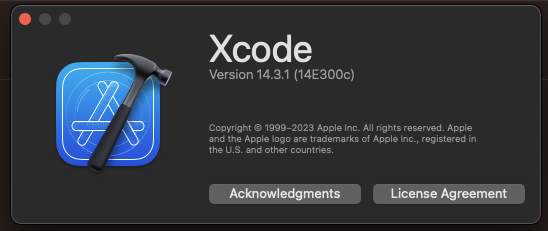

# iOS Clip Challenge App

 Documentation for iOS Cip Code Challenge

 ## App Architecture
 This app use a variation of MVVM architecture, adding Uses Cases, Routers and Repositories to separate elements in a single responsibility principle, the app is divided in:

 ### Views
Views are the UI elements, in this case, the view controllers, they are responsible for fill and presentation of the data, they are also responsible for the user interaction, and they're the ones that trigger the view models.

### View Models
View models are like a bridge between the views and the use cases, they are responsible for the presentation logic, they receive the data from the use cases and format it to be presented in the views, they also receive the user interaction from the views and trigger the use casese, the view models are also responsible for call the router to navigate to another view.

### Router
The router is responsible for the navigation between views and configure the presentacion style of the next views,

### Use Cases
The use cases are responsible for the business logic, they receive the data from the repositories and notify to view model or if is the case change the app state. the use case is the angulary stone of the app, it's the one that knows how to get the data and how to process it. the use case don't know anything about the views or view models, it only knows about the repositories. the approach of the use cases is to be as generic as possible, so they can be reused in other views, for example imagine a login usecase that can be used in a login view, but also in a quick login view, or a login view in a modal, or a login view in a tab bar, the use case should be able to handle all those cases without code duplications.

### Repositories
The repositories are responsible for the data, they know how to get the data from the network, database or any other source, they are the ones that know how to parse the data and return it to the use cases.

### Models
The models are the data of the app, they are the ones that are passed between the repositories, use cases and view models, they are the ones that are presented in the views.

## Considerations
- The app is written in Swift 5.0
- The app is compatible with iOS 16 or newer
- The project was created using Xcode 14.3.1

